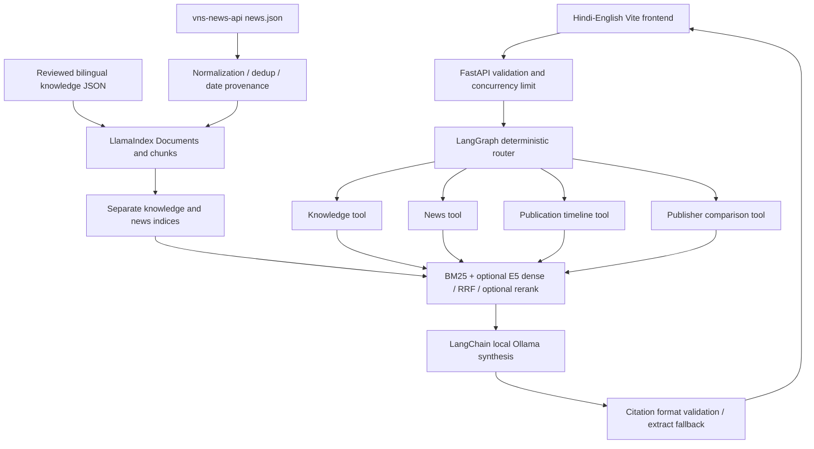
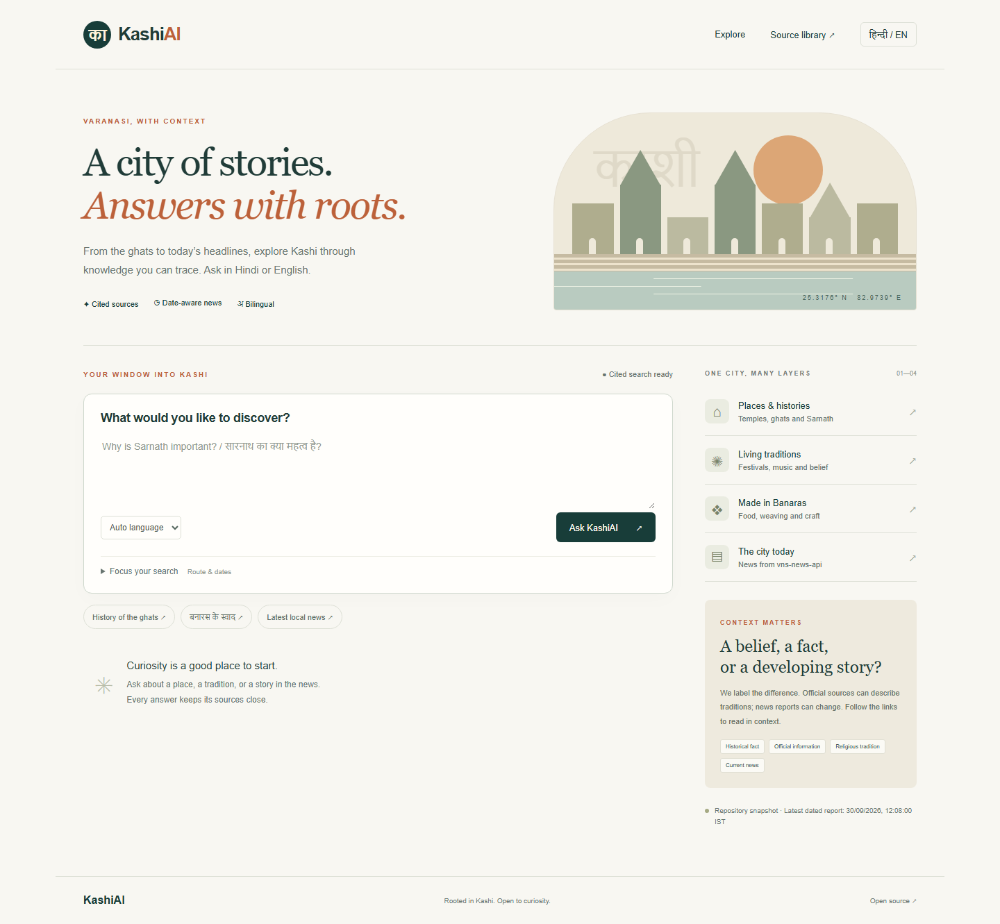

# KashiAI · काशी एआई

**A city of stories. Answers with roots.** A Hindi–English Varanasi knowledge and local-news assistant built around this repository's existing `vns-news-api` feed. Ask about Sarnath, a Banarasi craft, or recent headlines; inspect the evidence and see whether each claim is history, official information, religious tradition, or news.

This is a runnable portfolio project with FastAPI, a responsive Netlify-ready frontend, LlamaIndex ingestion and dense retrieval, BM25 fusion, LangChain tools/model adapters, and a bounded LangGraph workflow. No paid API is required. It is a growing, curated knowledge collection, not a complete encyclopedia or independently verified news service.

## Existing feed stays intact

The original `news.json`, `events.json`, `varanasi-panchang-calendar.json`, `varanasi-panchang-daily.json`, `scripts/build_local_news_feed.py`, and `.github/workflows/update-news.yml` are unchanged. Existing consumers keep the same URLs and JSON schema. The original hourly workflow still maintains news for Varanasi, Mirzapur and Jaunpur. KashiAI reads only `cityId=varanasi` and adds no writes to these files. It does not index the panchang/event files as verified current events.

## What you can demonstrate

| Capability | Implementation |
| --- | --- |
| Hindi / English questions | Unicode-aware BM25, bilingual knowledge, query aliases; multilingual E5 in full mode |
| Source-grounded answers | Numbered citations, publisher links, dates, claim labels, no-evidence abstention |
| Static + fresh news RAG | Separate indices, background feed refresh, stale/snapshot notices |
| Hybrid retrieval | LlamaIndex dense search + BM25, reciprocal-rank fusion, optional multilingual cross-encoder |
| Agentic workflow | LangGraph conditional routing to four LangChain tools; bounded retrieve → synthesize path |
| Local inference | Ollama through LangChain; optional paid provider is explicit opt-in |
| Portfolio validation | Retrieval evaluation, legacy regression tests, API tests, desktop/mobile browser tests, CI |

## Run locally

Requirements: Python 3.11+, Node 22+, Git. Run from the repository root.

```bash
python -m venv .venv
# macOS/Linux
source .venv/bin/activate
# Windows PowerShell instead: .venv\Scripts\Activate.ps1
pip install -c requirements-tested.txt -e '.[dev]'
```

### Lightweight search (no model downloads)

```bash
# macOS/Linux
export KASHI_PROVIDER=extractive
export KASHI_EMBEDDINGS=none
# PowerShell instead:
# $env:KASHI_PROVIDER='extractive'
# $env:KASHI_EMBEDDINGS='none'
uvicorn kashiai.api:app --reload --port 8000
```

This is **BM25 + cited extracts**, not a generative or dense-search demo. Hindi knowledge has editorial translations. Hindi news remains Hindi when there is no LLM, even if English is requested; the response explains that limitation. Without environment overrides, generation defaults to local Ollama and retrieval to BM25. An absent Ollama server falls back to extracts.

### Full local AI: multilingual dense + BM25 + LLM

Install [Ollama](https://ollama.com/), then:

```bash
pip install -e '.[dense,dev]'
ollama pull qwen2.5:1.5b
export KASHI_PROVIDER=ollama
export KASHI_EMBEDDINGS=huggingface
export KASHI_MODEL=qwen2.5:1.5b
uvicorn kashiai.api:app --port 8000
```

For PowerShell use `$env:NAME='value'` for each export. Run `ollama serve` if the Ollama app is not already serving. E5 downloads on first launch. The model cache is reused by the libraries, while the small corpus indices are rebuilt in memory. Enable `KASHI_RERANK=true` for the multilingual `cross-encoder/mmarco-mMiniLMv2-L12-H384-v1` reranker; this costs memory and latency. Dense model initialization fails clearly if dependencies or weights are missing; it never silently claims hybrid search while running BM25.

The [Qwen2.5 1.5B variant](https://ollama.com/library/qwen2.5:1.5b) uses Apache 2.0 and is the small local default. Bigger models can improve Hindi generation; measure them on your hardware. The 3B variant has a different license, so do not assume every size shares the same terms. Local compute and downloads still use your machine's resources.

In another terminal:

```bash
cd frontend
npm ci
npm run dev
```

Open `http://localhost:5173`. Backend docs: `http://localhost:8000/docs`. Frontend connection: `frontend/.env.local` may contain `VITE_API_URL=http://localhost:8000`; rebuild when changing it. `.env.example` is a reference: the Python service does not automatically load it.

### Docker

```bash
# Lightweight backend
docker compose up --build
# Full local AI backend (first build downloads Python/model dependencies)
docker compose -f compose.yaml -f compose.ai.yaml up --build -d
docker compose -f compose.yaml -f compose.ai.yaml exec ollama ollama pull qwen2.5:1.5b
```

The frontend still runs with `npm run dev`. Until Ollama has the requested model, responses use extracts. CPU inference may exceed the model timeout on weak hardware; this is surfaced as a fallback. Docker model caches use named volumes. Container starts as a non-root user. The default image contains no torch or LLM weights.

## Architecture



**Roles of the frameworks:** LlamaIndex owns Document ingestion, 384-token chunking with 48-token overlap, and VectorStoreIndex retrieval. LangChain exposes structured retrieval tools and model adapters. LangGraph controls explicit route, retrieval and synthesis nodes. Routing uses inspectable bilingual rules, with a user override; it is not an autonomous web-browsing agent and cannot execute arbitrary tools. The graph is bounded with no retry loops or external side effects.

**Retrieval decisions:** Separate indices prevent history from masquerading as news. Unicode tokenization preserves Hindi combining marks. BM25 scores must be positive; dense cosine scores must reach 0.72 before RRF (constant 60). Each record contributes once per ranked list. The dense threshold is a starting heuristic, not calibrated confidence. Full-corpus dense ranking before date filtering preserves recall for this small dataset; migrate to a vector database with native metadata filters when scaling. Optional reranking reorders top candidates and does not make its scores comparable to RRF scores.

**Time and news:** A worker refreshes the configured feed every 15 minutes. Replacement indices are built before the active snapshot is swapped. Requests do not fetch arbitrary URLs. Feed size is bounded to 5 MB / 10,000 entries, and failed refreshes retain the last usable snapshot. The original publisher date may be an update timestamp; the generator's `updatedAt` is never treated as publication time. Naive legacy dates are explicitly assumed Asia/Kolkata. Relative dates such as `आज` stay unknown. Implausible future dates are rejected. Filters are inclusive IST calendar days; today/yesterday/week/latest resolve relative to request time. “Latest” means the past three IST calendar days, not guaranteed real-time completeness. Timelines use report publication dates, not independently established event dates.

**Comparison:** Topic-matched articles are interleaved across publishers. Fewer than two matching publishers triggers a warning. Different reports may describe different events; similar wording is not independent corroboration. News deduplication uses canonical URLs and same-publisher normalized titles, retaining cross-publisher coverage.

**Answer limitations:** Citation checks reject missing, invalid or out-of-range markers and generated URLs. They do not prove that a model's claim is entailed by its citation. Retrieved text is delimited and treated as untrusted in the prompt, but prompt injection defenses are not a security guarantee. The UI renders text rather than source/model HTML and only creates HTTP(S) links. Requests are stateless, limited to 1,000 question characters, 10 results and two concurrent model calls per process. Add a reverse-proxy body limit, authentication and rate limiting before exposing costly inference widely. CORS alone is not access control. Paid-provider requests send the question and retrieved snippets to that provider.

## API

```bash
curl http://localhost:8000/health
curl -X POST http://localhost:8000/api/ask \
  -H 'Content-Type: application/json' \
  -d '{"question":"सारनाथ का क्या महत्व है?","language":"hi","route":"auto","top_k":5}'
```

`POST /api/ask`: `question`, `language` (`auto|hi|en`), `route` (`auto|knowledge|news|timeline|compare`), optional `since`/`until` ISO dates, `top_k`. Returns answer, citations with full provenance, warnings, route trace, actual retrieval/generation modes, latency and feed status. `/api/sources` exposes the reviewed knowledge catalog. `/health` reports readiness and feed status; it does not promise model availability or news accuracy. Date filtering applies to news tools; choose `auto` or `news` when entering dates.

## Sources and data policy

The initial corpus has **40 brief bilingual editorial records from 17 source pages**, covering temples, ghats, Sarnath, history, culture, festivals, food, crafts, education, people and places. Records carry stable IDs, URLs, publisher, language, category, claim type, review date and rights notes. These are focused introductions, not long-form scholarship. [Source policy and expansion process](docs/SOURCES.md) lists the review rules and limitations.

We prefer district administration, the Ministry of Tourism and UNESCO for static knowledge; news comes primarily from the existing `vns-news-api` feed. Official status is provenance, not automatic truth: religious stories on official tourism pages are still labeled tradition. The new assistant does not scrape full publisher articles, bypass restrictions or replicate publisher images. Existing publisher snippets retain their rights. Source URLs, excerpts, multilingual model licenses and the original repository's data rights must be reviewed for the intended deployment.

## Deployment

1. **Netlify frontend:** import this repository, select the feature branch to preview, and use the checked-in `netlify.toml`. Set `VITE_API_URL` to your HTTPS backend URL before building. No secrets belong in `VITE_*` values. [Netlify environment documentation](https://docs.netlify.com/build/configure-builds/environment-variables/).
2. **Render lightweight backend:** import `render.yaml`, choose the free plan, and set `KASHI_CORS_ORIGINS` to the exact Netlify origin (no trailing slash). The image runs cited BM25 search with no model downloads. [Render free services](https://render.com/docs/free) sleep when idle and have quotas; cold starts can take about a minute. This is a demo path, not a production SLA. Confirm current eligibility and resource limits in your account.
3. **Free local inference:** use the full local setup or Docker AI overlay on your own computer. A small free cloud host should not be expected to serve an LLM plus dense model reliably. Do not expose Ollama directly to the public internet. Hosting full inference requires sufficient hardware; optional paid providers are a separate choice.

For an optional OpenAI-compatible integration, install `.[paid]`, set `KASHI_PROVIDER=openai`, `KASHI_MODEL` to an available model you choose, and provide `OPENAI_API_KEY` only in backend secrets. Nothing selects or bills a paid provider by default. Hugging Face Docker Spaces are an alternative container host, but [current creation rules](https://huggingface.co/docs/hub/spaces-overview) require a paid plan for compute Spaces; they are not presented here as a universally free backend.

## Tests and evaluation

```bash
pytest -q
ruff check kashiai tests evaluation
python -m evaluation.run
cd frontend
npm ci
npx playwright install chromium
npm test
npm run build
```

The 24-case development set measures Recall@5, MRR@5, nDCG@5, routing accuracy, unanswerable-query abstention and structural citation ID validity. Results include actual retrieval mode and per-question hits in `evaluation/results.json`. Run with `KASHI_EMBEDDINGS=huggingface` for a separate dense-mode measurement. Tests exercise real LlamaIndex dense plumbing with mock embeddings; that is **not** evidence of multilingual E5 semantic quality. Dated synthetic news fixtures test filtering and timeline order independently of the changing live feed. Browser tests cover desktop/mobile, source rendering, error recovery, dates and unsafe HTML. CI also builds and smoke-tests Docker. See [validation notes](docs/VALIDATION.md) for what has actually been run.

The dataset is small and authored alongside the corpus. Its scores are development diagnostics, not benchmark claims. Human evaluation is still needed for Hindi fluency, citation entailment, source disagreement and prompt injection. Suggested review rubric: score relevance, factual support, claim-type correctness, date interpretation and Hindi naturalness from 1–5, recording the exact model/version and corpus revision. Do not label structural citation validity as “faithfulness.”

## Demo questions

- Why is Sarnath important in Buddhist history?
- काशी में मोक्ष की मान्यता क्या है?
- Tell me about Banarasi silk and weaving communities.
- काल भैरव को काशी का कोतवाल क्यों कहते हैं?
- What connects Varanasi with UNESCO's music network?
- आज वाराणसी की ताज़ा खबर क्या है?
- Show a timeline of flood reports, using an explicit date range.
- Compare publishers' flood coverage; point out missing sources.
- What is the quantum superconducting temperature of Kashi? (Expected: insufficient evidence.)

## Screenshots

The following captures are from the working local app in cited-extract mode. Deployment screenshots can replace them after hosting.



[Hindi answer with sources](docs/screenshots/cited-answer.png) · [Mobile view](docs/screenshots/mobile.png). Reproduce with `node capture.mjs` from `frontend/` while the local frontend and backend are running.

## CV-ready project bullets

- Built a Hindi–English Varanasi assistant integrating FastAPI, LangGraph routing, LangChain tools and LlamaIndex ingestion/retrieval, with local model inference and source citations.
- Implemented dense/BM25 reciprocal-rank fusion, optional multilingual reranking, publisher deduplication, claim-type metadata and IST-aware news filtering.
- Added reproducible retrieval evaluation, legacy feed regression coverage and desktop/mobile browser checks, with Docker and Netlify deployment configuration.

Only add numerical achievements after reproducing the relevant mode's evaluation. No production users, accuracy or scale are claimed.

## License

New KashiAI code is MIT licensed; see `LICENSE-KASHIAI`. Existing repository files and third-party data are excluded from that grant. Model and source licenses remain separate.
